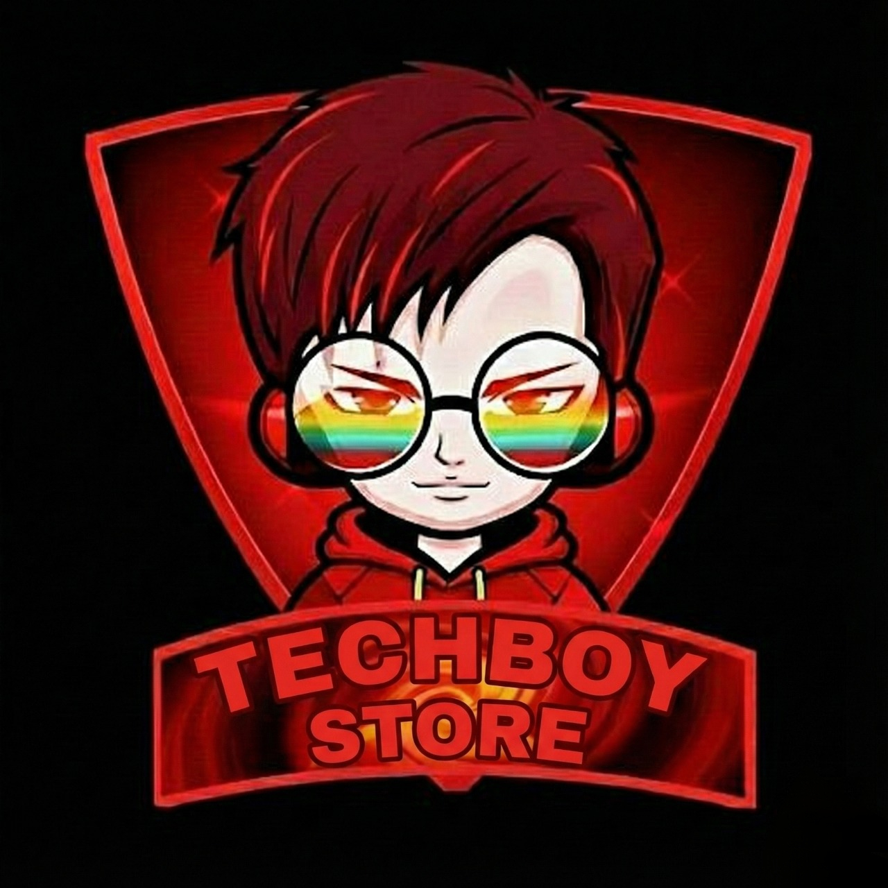

<div align="center">

  

  # <span style="color: #ff8c42;">TECHBOY STORE</span>
  
  **The Next-Generation AI Smartphone Concierge & E-Commerce Hub**

  [](https://techboy-store.vercel.app/)
  [](https://github.com/chimataraghuram/TECHBOY-STORE)
  [](https://opensource.org/licenses/MIT)

  > `⚡ Unbiased, Data-Driven Smartphone Discovery`  
  > `🤖 Conversational AI Built on NVIDIA NIM Llama 3.1`  
  > `⚖️ Advanced Head-to-Head Technical Spec Matching`

  **An ultra-modern, full-stack shopping application built to revolutionize how you find your next smartphone. Fusing sleek glassmorphic UI design, real-time analytics, and an intelligent chatbot, TECHBOY STORE delivers a zero-compromise discovery experience.**

</div>

---

## 🌐 Live Demo
Experience the premium tech shopping journey yourself: [https://techboy-store.vercel.app/](https://techboy-store.vercel.app/)

> "We cut through the marketing noise to bring you raw specs, smart comparisons, and AI recommendations tailored exactly to your wallet."

---

## 🖼️ Project Screenshots

<div align="center">
  <h3>🚀 Hero Section</h3>
  <p>An immersive gateway featuring 3D particle physics, neon typography, and fluid Framer Motion transitions.</p>
  
  
  <br /><br />
  
  <h3>🤖 TechBoy AI Assistant</h3>
  <p>A smart, floating conversational agent that instantly parses catalogs to recommend the perfect device based on natural language.</p>
  

  <br /><br />
  
  <h3>📊 Analyst Picks</h3>
  <p>A seamless, responsive product grid engineered with instant category filters, budget sliders, and deep-link product tags.</p>
  
  
  <br /><br />
  
  <h3>⚖️ Comparison Engine</h3>
  <p>A frosted-glass overlay that dissects devices side-by-side, analyzing processors, cameras, and battery metrics instantly.</p>
  
  
  <br /><br />
  
  <h3>🔐 Auth Experience</h3>
  <p>A highly secure, beautiful authentication flow utilizing JSON Web Tokens, shielded by a modern UI aesthetic.</p>
  
</div>

---

## ✨ Features

| Icon | Feature | Description |
| :--- | :--- | :--- |
| 🤖 | **TechBoy AI Chatbot** | Integrated NVIDIA NIM Llama 3.1 LLM that talks tech. It understands your budget, prioritizes gaming chips, and even works offline using a custom algorithmic fallback. |
| 📱 | **Analyst Picks** | Carefully curated smartphone tiers with an intuitive, unified filtering system that guarantees you find the best value at any price point. |
| ⚖️ | **Smart Comparison** | A head-to-head evaluation tool designed to let you stack up to three devices against each other, comparing everything from sensors to screen refresh rates. |
| 🌐 | **Dynamic 3D UI** | A visual masterpiece utilizing Three.js and custom particle configurations, providing users with a luxurious, app-like feel right in their browser. |
| 📈 | **Weighted Trending** | An intelligent sorting algorithm running on the backend that dynamically highlights products based on real-time community engagement. |
| 🧠 | **Smart Recommendations** | Content-based suggestion engines that automatically pair you with similar devices if your first choice is out of stock. |
| 📊 | **Analytics Suite** | Admin-level oversight tools that quietly log click-through rates, referral pathways, and top-performing products. |
| 🔐 | **JWT Integration** | Bulletproof API security layered with personalized user states, all handled flawlessly through Django REST Framework. |

---

## 🛠️ Tech Stack

### Frontend
- **React 19** - State-of-the-art UI rendering with advanced Hooks
- **Vite** - Blazing fast hot-module replacement and optimized builds
- **Vanilla CSS** - Hand-crafted, zero-dependency neon and glassmorphism styling
- **Framer Motion & Three.js** - Delivering 60fps animations and 3D web graphics

### Backend (Production-Grade)
- **Django 6** - The bedrock of the backend, ensuring extreme stability
- **DRF (REST Framework)** - Serving cleanly serialized JSON endpoints
- **Service Layer Architecture** - Enterprise-grade logic separation keeping views incredibly thin
- **Caching & Throttling** - Defending against spam and delivering cached data instantly via LocMem
- **SQLite / PostgreSQL** - Highly optimized, indexed database modeling
- **Gunicorn** - Ensuring concurrent requests are processed securely in production

---

## 📂 Project Structure

```text
TECHBOY-STORE/
├── backend/                # Django REST API (Production Setup)
│   ├── api/                
│   │   ├── services/       # Decoupled Business Logic (Analytics, Products)
│   │   ├── models.py       # Optimized DB Models with Indexing
│   │   ├── views.py        # Thin ViewSet Layer
│   │   ├── serializers.py  # Advanced Data Transform Layer (Score Logic)
│   │   └── exceptions.py   # Global Unified JSON Error Handler
│   └── core/               # Central Config (Logging, Cache, Throttle)
├── images/                 # Categorized Project Assets (Logos, Heroes, etc.)
├── scripts/                # Data Parsing and Automation Scripts
├── frontend/               # React Frontend (Vite)
│   ├── src/                    
│   │   ├── components/     # Modular UI Components (ChatPopup, CompModal, etc.)
│   │   └── App.css         # Neon/Glassmorphism Design System
│   └── public/             # Static Assets
├── workflows/              # Automation Workflows (e.g., n8n Price Drop)
└── README.md               # Production Documentation
```

---

## 🛣️ Future Roadmap
- [x] **AI Chatbot**: Ground-up NVIDIA LLM integration for bespoke shopping assistance.
- [x] **Global Price Alert**: Subscription models letting users track hardware price depreciation.
- [x] **Deployment**: Seamless hosting CI/CD via Vercel and PythonAnywhere.
- [ ] **User Wishlists**: Enabling users to store and share their ultimate dream tech loadouts.

---

## 🤝 Contributing
1. **Fork** the repository.
2. Create your **Feature Branch** (`git checkout -b feature/AmazingFeature`).
3. **Commit** your changes (`git commit -m 'Add some AmazingFeature'`).
4. **Push** to the branch (`git push origin feature/AmazingFeature`).
5. Open a **Pull Request**.

---

## 📜 License
Distributed under the **MIT License**. See `LICENSE` for more information.  
*Note: Please give appropriate credit if you use this UI template.*

---

## 👨‍💻 Author
**Chimata Raghuram**  
[](https://github.com/chimataraghuram)
[](https://linkedin.com/in/chimataraghuram)

<div align="center">
  <br />
  <b>COOKED BY RAGHU</b> ❤️
</div>
